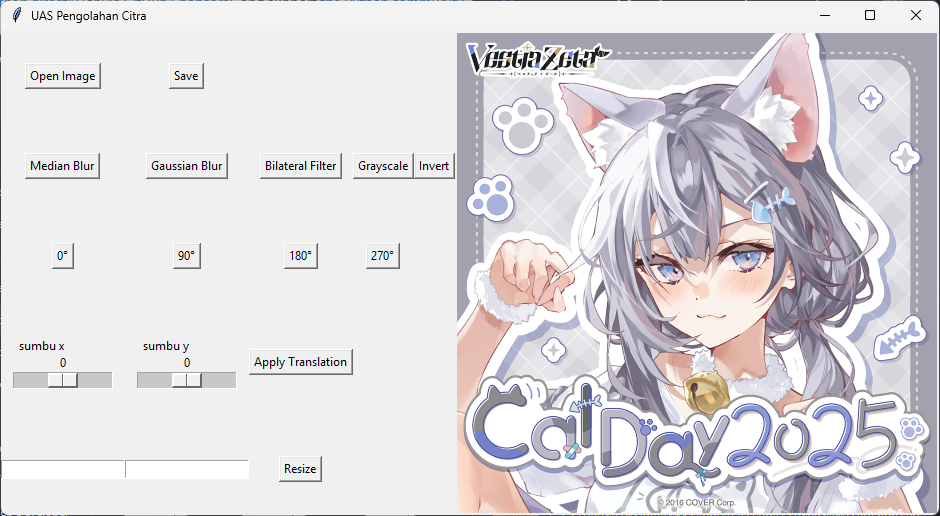

# Image Editor

This is an image editing application developed as the final project for the Image Processing course, focusing on the implementation of OpenCV library functions.

## Features

- Open and save images in various formats
- Apply different image filters:
    - Median Blur
    - Gaussian Blur
    - Bilateral Filter
- Image transformations:
    - Rotation (0°, 90°, 180°, 270°)
    - Translation along X and Y axes
    - Resize to specific dimensions
- Color operations:
    - Convert to grayscale
    - Invert colors

## Required Libraries

To run this application, you need to install the following Python libraries:

```bash
pip install opencv-python
pip install numpy
pip install pillow
```

## Screenshot



## How to Use

1. Click "Open Image" to select an image file.
2. Apply different filters and transformations using the buttons.
3. Use sliders to control translation values.
4. Enter dimensions and click "Resize" to change image size.
5. Click "Save" to save your edited image.

## Known Issues

- When the image resolution is too large, the application window will also enlarge.